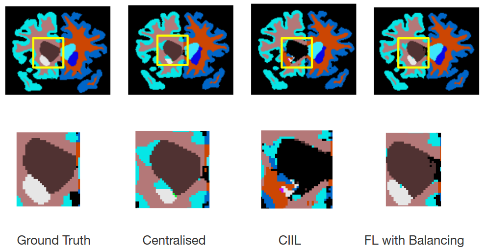

# Federated Segmentation

This repo contains code for the proposed Federated Segmentation with Loss Balancing algorithm to segment 33 classes in whole-brain MRI volumes.

## Run

> python [main_fed.py](main_fed.py)

See the arguments in [options.py](utils/options.py). 

For example:
> python main_fed.py --dataset brain --model quicknat --epochs 50 --gpu 0 

## Requirements
python 3.6

pytorch 0.4

## Results
### Quantitative Results

| Method        | Best Performance (Dice |
| ------------- | ---------------------- |
| Baseline      | 0.867 |
| **FL with Loss Balancing**  | **0.840**  |
| Brain Torrent | 0.863 |
| CIIL          | 0.829 |

### Qualitative Results

